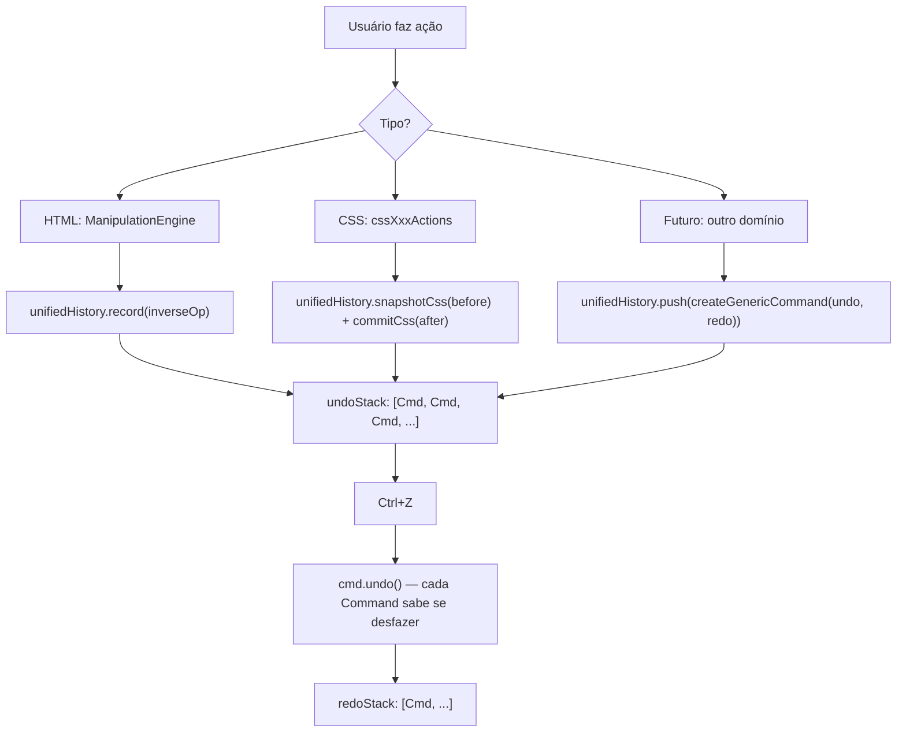

# Unified History — Arquitetura do Sistema de Histórico

> Documento técnico para desenvolvedores. Descreve como o sistema de Undo/Redo funciona e como adicionar suporte a novos domínios.

## Visão Geral

O editor usa um **histórico unificado** (`UnifiedHistoryManager`) com uma única pilha cronológica de comandos. HTML, CSS e qualquer domínio futuro (ex: JS) compartilham essa pilha, garantindo que Ctrl+Z sempre desfaça a última ação independente do tipo.

```
Ação 1 (HTML): mover div       → Command[html] na undoStack
Ação 2 (CSS):  alterar color   → Command[css]  na undoStack
Ação 3 (CSS):  alterar margin  → Command[css]  na undoStack

Ctrl+Z → desfaz "margin"   (CSS)
Ctrl+Z → desfaz "color"    (CSS)
Ctrl+Z → desfaz "mover div" (HTML)
```

---

## Arquivo principal

```
src/editor/history/UnifiedHistoryManager.js
```

Exporta dois itens:
- `unifiedHistory` — singleton reativo, use em todos os domínios
- `createGenericCommand(undoFn, redoFn, type?)` — fábrica para domínios customizados

---

## Estratégias embutidas

### HTML — Inverse Operation

Cada primitiva da `ManipulationEngine` grava **a sua própria inversa** via `unifiedHistory.record(op)`. O Undo executa as inversas, captura as novas inversas geradas e as coloca no redoStack.

```
removeNodeAt(parentId, i)  → grava inversa: insertNodeAt(parentId, i, node)
insertNodeAt(parentId, i)  → grava inversa: removeNodeAt(parentId, i)
setAttribute(id, name, v)  → grava inversa: setAttribute(id, name, oldValue)
```

**API para `ManipulationEngine`:**
```js
unifiedHistory.beginTransaction()   // agrupa múltiplas ops em 1 undo
unifiedHistory.record(op)           // grava inversa de uma primitiva
unifiedHistory.commit()             // consolida o grupo
unifiedHistory.rollback()           // descarta sem gravar
```

### CSS — Snapshot Before/After

Tira uma foto serializada da `cssLogicTree` **antes** e **depois** de cada mutação. Undo restaura o "before"; Redo restaura o "after". Files `external` (read-only) são excluídos do snapshot para economizar memória.

**API para CSS actions:**
```js
unifiedHistory.snapshotCss(logicTree, applyFn)  // antes da mutação
// ... mutação ...
styleStore.applyMutation(doc)
unifiedHistory.commitCss(logicTree)             // após a mutação

// Se a operação falhar (retornou null/false):
unifiedHistory.discardCssSnapshot()
```

Onde `applyFn` deve ser:
```js
const applyFn = () => styleStore.applyMutation(useEditorStore().getIframeDoc())
```

> `applyFn` é chamada durante undo/redo para sincronizar o snapshot restaurado → DOM.  
> O `doc` é obtido dinamicamente para suportar trocas de iframe.

---

## Integração atual por arquivo

| Arquivo | Integração |
|---|---|
| `ManipulationEngine.js` | `setEngine(this)` no constructor + usa `record/beginTransaction/commit/rollback` |
| `cssDeclarationActions.js` | `snapshotCss/commitCss` em todas as 4 funções |
| `cssRuleActions.js` | `snapshotCss/commitCss` em create/update/delete |
| `cssAtRuleActions.js` | `snapshotCss/commitCss` em create/update/delete |
| `EditorStore.js` | `undo()/redo()` delegam para `unifiedHistory.undo()/redo()` |
| `StyleStore.js` | `rebuildLogicTree()` chama `unifiedHistory.clearCssHistory()` |
| `HistoryControls.vue` | Um único par de botões ligado a `unifiedHistory.canUndo/canRedo` |

---

## Como adicionar um novo domínio (ex: editor de JS)

```js
import { unifiedHistory, createGenericCommand } from '@/editor/history/UnifiedHistoryManager'

// Antes de fazer a mudança:
const before = editor.getValue()

// Faz a mudança:
editor.setValue(newCode)

// Registra o comando:
unifiedHistory.push(
  createGenericCommand(
    () => editor.setValue(before),    // undo
    () => editor.setValue(newCode),   // redo
    'js'                              // tipo (para filtros futuros)
  )
)
```

---

## Limpeza automática do histórico CSS

Quando `styleStore.rebuildLogicTree()` é chamado, a `cssLogicTree` é substituída por um novo array. Os snapshots antigos apontariam para o array anterior — por isso `clearCssHistory()` é chamado automaticamente:

```js
// Em StyleStore.rebuildLogicTree():
cssLogicTree.value = markRaw(CssLogicTreeService.buildLogicTree(masterAst))
unifiedHistory.clearCssHistory()  // remove só commands _type==='css'
```

---

## Diagrama de fluxo


